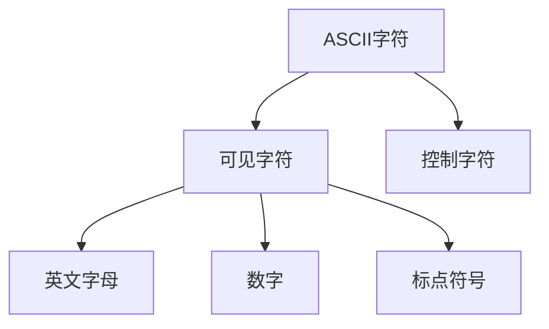

### ASCII字符集

​		计算机在美国出现后，面临需要将自己的字符存储在计算机的需求，需要开始思考字符的存储问题。

**字符集设计概念：**

​		分为可见字符和控制字符，只能表示127位字符

- 可见字符  32-126  共计95个
- 控制字符  0-31和127（删除） 共计33个   

**码位记录方式：** 一一对应

**可存储字符量：** 127位字符

**计算机存储方式：** 将数字转为二进制，用一个字节的后七个位直接一一对应存储

##### 扩展ASCII字符集

但当欧洲其他国家引入使用计算机后，不够用

于是将首位改为1，扩展为可以表示256位字符

### GB2312字符集

**出现了问题：** 汉字等国家引入使用计算机后，扩展ASCII字符集还是不够用

**字符集设计概念：**（即设定码位）【区号+xy轴坐标】、高位和低位都大于127。

- 分区记录，共计94个区，每个区含94个位，共计8836个码位
- 【01-09】区收录除汉字外的682个字符
- 【10-15】区为空白区，没有使用
- 【16-55】区收录了3755个一级汉字，按拼音排序
- 【56-87】区收录3008个二级汉字，按部首/笔画排序
- 【88-94】区为空白区，没有使用

**可存储字符量：** 8836个汉字

**计算机存储方式：** 

1. 区号和xy轴坐标分别转为16进制
2. 分别加和160，即`0xA0`
3. 组合，即是表示方式

**94x94的由来**

​		这就涉及到GB2312编码设计时遵循的标准了。

​		先铺垫一下，对于 ASCII 码，大家应该都很熟悉，ASCII 码是7位编码，0x00-0x1F (0-31) 是控制字符，0x20-0x7F (32-127) 是图形字符。

​		ECMA 在 1974 年搞了个规范叫 ECMA-35，已经被采纳为[ISO 2022](https://link.zhihu.com/?target=https%3A//zh.wikipedia.org/wiki/ISO/IEC_2022)标准，GB2312就是参考的这个标准，标准内容如下

- 对于七位的编码设计标准，分为32字的控制块（也就是控制字符）和**94字**的图形块（也就是可见字符，如果包含空格和DEL，就是96个），这块和ASCII码唯一的区别就是DEL在图形块中。

  - 0x00 - 0x1f（0-31） 保留给 C0 控制块

    0x20 - 0x7f（32-127） 保留给 G0 图形块（包括空格和 DEL）

- 对于八位编码设计标准
  - 0x00 - 0x1f（0-31）分配给 C0 控制块
  - 0x20 - 0x7f（32-127）分配给 G0 图形块（包括空格和 DEL）
  -  0x80 - 0x9f（128-159） 分配给 C1 控制块
  - 0xa0 - 0xff（160-255）分配给 G1、G2 和 G3 图形块，用转义序列切换

既然GB2312是双字节，自然需要两个图形块，也就是94x94

**加160的原因：**

1. GB2312 是双字节编码，为了与 ASCII 码区分开，字节的第8位必须是1，既然GB2312是8位编码，至少要从 0x80(128, 1000 0000) 开始ß
2. 又根据上面的规定，0x80 - 0x9f 要留给控制块，所以只能从 0xA0 开始
3.  为什么 GB2312 编码不是从 0xA0 开始，而是0xA1 开始呢？ 因为 0xA0 正好是图形块的空格，所以就从 0xA1 编码

[参考资料地址](https://www.zhihu.com/question/21918229)

### GBK字符集

**出现了问题：** 对于汉字而言，8836个码位还是不够用

**码位记录方式：**【区号+xy轴坐标】、高位（16位的前8位）需大于127，低位（16位的后8位）不需要了。

**可存储字符量：** 8836个汉字 + 新增的2w+个汉字和符号

**计算机存储方式：** 同GB2312

### GB18030字符集

**出现了问题：** 新增几千个少数民族字符

**码位记录方式：**【区号+xy轴坐标】、高位需大于127，低位不需要。

**可存储字符量：** 6763个汉字 + 新增的2w+个汉字和符号；

**计算机存储方式：** 同GB2312

### Unicode

​		如果每个国家都实现一套自己的编码标准，那就太混乱了，于是ISO组织提出万国码的概念，也就是我们常说的 -- Unicode。

##### 基础介绍

​		（中文：万国码、国际码、统一码、单一码）是计算机科学领域里的一项业界标准。它对世界上大部分的文字进行了整理、编码。Unicode 使计算机呈现和处理文字变得简单。

​		  Unicode 至今仍在不断增修，每个新版本都加入更多新的字符。目前 Unicode 最新的版本为 2020 年 3 月 10 日公布的 13.0.0，已经收录超过 14 万个字符。

​		现在的 Unicode 字符分为 17 组编排，每组为一个平面（Plane），而每个平面拥有 65536（即 2 的 16 次方）个码值（Code Point）。然而，目前 Unicode 只用了少数平面，我们用到的绝大多数字符都属于第 0 号平面，即 **BMP平面**，除了 BMP 平面之外，其它的平面都被称为 **补充平面**。

##### UCS-2字符集

**字符集设计概念：** 转化为16进制进行一一对应存储

**码位记录方式：** 采用两个字节，直接一一对应

**可存储字符量：** 65536个字符

**计算机存储方式：** 采用两个字节存储

##### UCS-4字符集

**字符集设计概念：** 转化为16进制进行一一对应存储

**码位记录方式：** 采用四个字节，直接一一对应

**可存储字符量：** 近43亿个字符

**计算机存储方式：** 采用四个字节存储

##### UTF-8字符集

由于导致存储空间消耗翻倍，Unicode在推出后并没有被广泛接收，直到UTF-8的出现。

